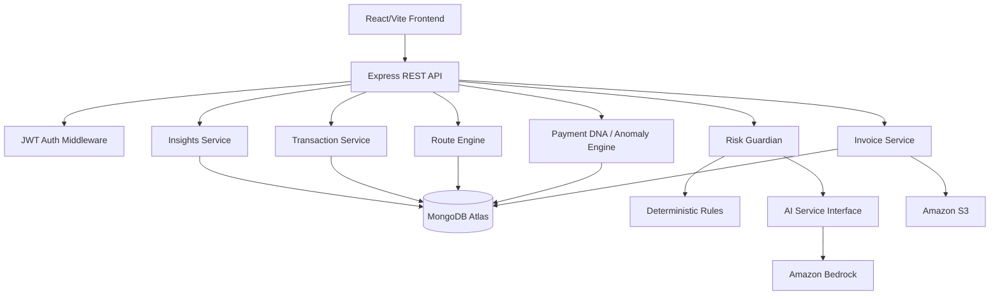

# FinSight AI Backend

**“Before money moves, FinSight thinks.”**

Backend-only MVP for FinSight AI, an explainable payment intelligence and control layer. The implementation follows the supplied PRD: invoice extraction, Payment DNA, deterministic anomaly detection, hybrid Risk Guardian, What Changed, simulated route intelligence, payment simulation, monitoring, insights, and optional testnet settlement.

## 1. Architecture

The PRD specifies React/Vite → Express → services → MongoDB Atlas, with AI/OCR/payment adapters outside the core service layer. This backend keeps that boundary and adds AWS in a meaningful but optional way: Amazon Bedrock is the AI explanation adapter and Amazon S3 is the invoice storage adapter. MongoDB Atlas remains the primary database because the PRD explicitly defines MongoDB collections and document-shaped behavioral profiles; changing to DynamoDB would add migration complexity without improving the P0 workflow.



### AWS decision
- **Amazon Bedrock:** contextual explanation only. Critical risk signals and score are deterministic.
- **Amazon S3:** optional document storage; local disk is used when S3 is disabled.
- **MongoDB Atlas:** retained from the PRD as the system of record.
- **Lambda/API Gateway:** the code is Express-based and can be wrapped for Lambda later; the MVP runs as a normal Node server to keep local development and the hackathon demo simple.
- **DynamoDB:** not used in this MVP because MongoDB is the PRD-defined data model and is practical for nested Payment DNA documents.

## 2. Requirements covered

P0: dashboard API support, invoice/payment request extraction, Payment DNA, anomaly/risk analysis, What Changed, route comparison, recommendation, simulated execution, monitoring, and insights.

P1: optional testnet settlement adapter.

P2 production payment rails, banking integrations, merchant SDK, and real-money transfers are intentionally excluded.

## 3. Folder structure

```text
src/
  config/                 env + MongoDB connection
  controllers/            HTTP controllers
  routes/                 REST routes
  services/
    ai/                   Bedrock adapter + prompt/validation boundary
    risk/                 deterministic Risk Guardian + What Changed
    paymentDNA/           behavioral profile comparison
    invoice/              extraction + storage adapter
    route/                simulated route engine
    transaction/          payment simulation + monitoring
    insights/             database-derived insights
  models/                 Mongoose collections
  middleware/             JWT, errors, logging
  validators/             Zod request schemas
  types/                  Express request typing
  app.ts
  server.ts
scripts/seed.ts
 tests/
.env.example
package.json
 tsconfig.json
```

## 4. Environment variables

Copy `.env.example` to `.env`.

Required for the normal local MVP:
- `MONGODB_URI`
- `JWT_SECRET`
- `CORS_ORIGIN`
- `AI_PROVIDER=mock` (no AWS credentials required)

AWS mode:
- `AI_PROVIDER=bedrock`
- `AWS_REGION`
- `BEDROCK_MODEL_ID`
- AWS credentials through the normal AWS credential chain or environment variables

S3 mode:
- `S3_ENABLED=true`
- `S3_BUCKET`
- `AWS_REGION`

Do not commit `.env`. Never put wallet private keys or provider secrets in source code.

## 5. Installation

```bash
npm install
cp .env.example .env
npm run build
```

## 6. MongoDB setup

### Local MongoDB
Run MongoDB as a service, or start a local `mongod` instance, then use:

```text
MONGODB_URI=mongodb://127.0.0.1:27017/finsight_ai
```

### MongoDB Atlas
Create a database user, allow the development IP/network as appropriate, copy the Atlas connection string into `MONGODB_URI`, and keep credentials in `.env` only.

## 7. Seed demo data

```bash
npm run seed
```

The seed creates:
- business: `demo-business`
- vendor: `Acme Software Services`
- normal historical range: ₹2,00,000–₹5,00,000
- known account ending `4821`
- demo invoice: ₹18,70,000
- changed account ending `9137`
- early/urgent timing context
- three simulated routes

The demo is intentionally designed to trigger `AMOUNT_ANOMALY`, `ACCOUNT_CHANGE`, `NEW_DESTINATION`, and `TIMING_ANOMALY`, producing a HIGH assessment without claiming a fraud probability.

## 8. Run

```bash
npm run dev
```

or:

```bash
npm run build
npm start
```

Health check:

```text
GET http://localhost:5000/health
```

## 9. Authentication

The MVP includes a demo-login endpoint so the frontend can obtain a JWT without implementing password registration during the hackathon:

```http
POST /api/auth/demo-login
Content-Type: application/json

{
  "email": "demo@finsight.local",
  "business_id": "demo-business"
}
```

Use the returned token as:

```text
Authorization: Bearer <token>
```

Production authentication should replace demo-login with a real identity provider and enforce organization-level authorization.

## 10. API documentation

All API responses use:

```json
{ "success": true, "data": {} }
```

Errors use:

```json
{
  "success": false,
  "error": { "code": "VALIDATION_ERROR", "message": "..." }
}
```

### POST `/api/invoices/extract`
Supports JSON structured/manual input and `multipart/form-data` with `file`.

JSON example:

```json
{
  "vendor": "Acme Software Services",
  "amount": 1870000,
  "currency": "INR",
  "destination_account": "9876549137",
  "invoice_number": "FS-DEMO-001",
  "payment_details": { "urgent": true }
}
```

Text extraction fallback also accepts a `text` field. PDF/OCR adapters can be added behind the same service later.

### POST `/api/risk/analyze`

```json
{
  "invoice_id": "<invoice-id>",
  "amount": 1870000,
  "currency": "INR",
  "destination_account": "9876549137"
}
```

Returns `risk_score`, `risk_level`, `reasons`, `signals`, `recommended_action`, evidence, and optional AI explanation.

### GET `/api/risk/what-changed/:id`
Returns structured historical-vs-current differences for an invoice.

### GET `/api/vendors/:id/profile`
Returns the vendor's Payment DNA behavioral profile.

### POST `/api/routes/compare`

```json
{ "risk_score": 90 }
```

Returns at least three clearly simulated route options when demo routes exist.

### POST `/api/routes/recommend`

```json
{ "risk_score": 90 }
```

Returns a simulated route recommendation plus the reason/action. Route scoring is a configurable product parameter, not a universal financial rule.

### POST `/api/payments/simulate`

```json
{ "invoice_id": "<invoice-id>", "route_id": "DEMO-BANK-A" }
```

Simulation states include `INITIATED`, `PROCESSING`, `RISK_CHECK`, `ROUTING`, `SETTLEMENT`, and `COMPLETED`; critical-risk payments can become `BLOCKED`.

### GET `/api/payments/:id`
Returns payment details, status, risk information, selected route, timestamps, event timeline, exceptions, and simulated flag.

### GET `/api/insights/:merchantId`
Returns database-derived high-risk count, recurring anomaly signals, simulated value, route observations, and risk trends. It does not fabricate real-world statistics.

### POST `/api/settlement/testnet`
Disabled by default. When enabled, it still records a simulated/testnet settlement only. It never performs an irreversible real-money transfer.

## 11. Database collections

| Collection | Main purpose |
|---|---|
| `users` | business identity, role, auth metadata |
| `vendors` | Payment DNA behavioral profile |
| `invoices` | extracted payment requests |
| `transactions` | simulated execution and risk state |
| `risk_events` | explainable anomaly evidence |
| `routes` | simulated route attributes |
| `settlements` | optional simulated/testnet settlement record |

## 12. Risk design

The Risk Guardian deliberately uses:

1. deterministic business rules for critical signals;
2. reproducible weighted scoring from those signals;
3. AI only for contextual explanation;
4. structured-output validation before AI text is used.

The `0–100` risk score is an internal assessment and is **not** a calibrated probability of fraud.

Default thresholds can be changed with:

```text
RISK_LOW_MAX=24
RISK_MEDIUM_MAX=49
RISK_HIGH_MAX=79
```

Signals include:
`ACCOUNT_CHANGE`, `AMOUNT_ANOMALY`, `TIMING_ANOMALY`, `CURRENCY_CHANGE`, `FREQUENCY_ANOMALY`, `NEW_VENDOR`, `NEW_DESTINATION`.

## 13. AWS / Bedrock setup

Install and configure AWS credentials using the standard AWS credential chain. Set:

```text
AI_PROVIDER=bedrock
AWS_REGION=ap-south-1
BEDROCK_MODEL_ID=amazon.nova-lite-v1:0
```

The application calls Bedrock through the AWS SDK Converse API. If Bedrock fails, the deterministic risk result remains available and the AI explanation is omitted rather than allowing uncontrolled model output to decide the transaction.

For an AWS-hosted deployment, place the backend behind API Gateway/Lambda or run the existing Express server on an AWS compute service. The service boundaries already isolate AWS adapters from core risk logic.

## 14. S3 setup

Set:

```text
S3_ENABLED=true
S3_BUCKET=<your-bucket>
S3_PREFIX=invoices
```

The invoice storage adapter uses server-side AES-256 encryption. If S3 is disabled or unavailable by configuration, local development stores uploads under `uploads/`.

## 15. Testing

```bash
npm test
```

The suite covers Payment DNA anomaly signals, deterministic risk scoring/levels, What Changed, route demo requirements, and an end-to-end flow using `mongodb-memory-server`:

```text
invoice → vendor history → anomaly detection → risk analysis → route recommendation → payment simulation → transaction retrieval
```

## 16. Security

- secrets are environment-based;
- JWT middleware and business-level authorization structure are included;
- Helmet, CORS, rate limiting and JSON/request size limits are enabled;
- uploaded file size is bounded;
- errors are normalized and internal details are not returned by default;
- invoice destination accounts are masked in anomaly evidence;
- simulated/testnet operations are explicitly marked;
- no wallet private keys are stored;
- human review remains part of consequential payment decisions.

## 17. Known limitations

- MVP extraction is a deterministic text/structured-data fallback, not production-grade OCR.
- Route providers are simulated demo data, not live provider quotes.
- Payment execution is simulation only.
- Testnet settlement is an optional record-only adapter.
- AI explanation quality depends on the configured Bedrock model and access permissions.
- Risk thresholds/weights are hackathon product parameters and require validation on representative data before production use.

## 18. Future work

Aligned with the PRD: live provider adapters, richer anomaly signals, live status events, vendor verification integrations, banking/ERP integrations, production payment rails, treasury intelligence, merchant API/SDK, organization risk policies, and production-grade model evaluation.
